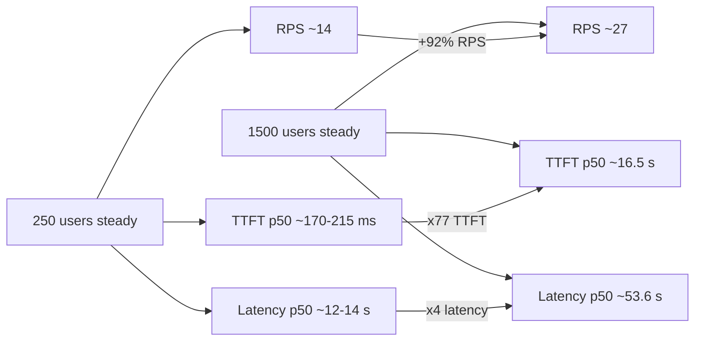

# Kimi-K2.6 на vLLM — сводный отчёт по бенчмаркам

**Модель:** `moonshotai/Kimi-K2.6`
**Движок:** vLLM (`http://127.0.0.1:8111/v1`)
**Период:** 21–22.04.2026 (Kimi-K2.6 + эталонный scenario после фикса SSE в **v1.2.1**)
**Железо:** стенд проекта (см. `configs/*`)
**Источник данных:** `bench/results/vllm/<timestamp>/` — `summary.json` + `time_series.csv` (для load-тестов). Каталоги прогонов часто только локально (см. `.gitignore`).

## Легенда метрик

- **TTFT p50/p95** — время до первого токена, мс.
- **Latency p50/p95** — полное время запроса, мс.
- **RPS** — завершённых запросов в секунду.
- **tok/s** — токенов в секунду (в `time_series.csv` — агрегат в 5-секундном окне, в `summary.json` — усреднение по всему прогону).
- **errors / error_rate** — число ошибочных запросов и их доля.
- **scenario** — микро-матрица `bench_openai.py` (prompt_chars × max_tokens × concurrency, по 1 раунду на сценарий).
- **load** — непрерывный нагрузочный тест `bench_load.py` с фазами `ramp_up` / `steady` / `ramp_down`.

## 1. Сводная таблица прогонов Kimi-K2.6

| Прогон (UTC старт) | Тип | Нагрузка | Длит. | Запросов | OK / Err | TTFT p50 / p95 | Latency p50 / p95 | RPS | tok/s |
|---|---|---|---:|---:|---|---|---|---:|---:|
| [20260421_144128](results/vllm/20260421_144128/summary.json) | scenario | c=1/8/32/128, 16 сценариев | ~7 мин | 169 | 58 / 111 | см. §2 | см. §2 | 0…0.47 | — |
| [20260421_181145](results/vllm/20260421_181145/summary.json) | scenario | c=1/8/32/128, 16 сценариев | ~12 мин | 169 | 32 / 137 | см. §2 | см. §2 | 0…0.43 | — |
| [20260421_183805](results/vllm/20260421_183805/summary.json) | load | 250 users, ramp 120 s / steady 900 s / down 60 s | 1 080 с | 15 540 | 15 540 / 0 | 168.6 / 461.4 | 12 568 / 14 412 | 14.38 | 14.54 |
| [20260421_191235](results/vllm/20260421_191235/summary.json) | load | 250 users, те же фазы | 1 080 с | 14 160 | 14 160 / 0 | 214.6 / 2 017.3 | 13 720 / 19 602 | 13.11 | 13.40 |
| [20260421_233822](results/vllm/20260421_233822/summary.json) | load | 1 500 users, steady 10 800 s | 10 980 с (~3 ч) | 297 498 | 297 498 / 0 | 16 492 / 18 156 | 53 654 / 56 545 | 27.09 | 27.65 |
| [20260422_104802](results/vllm/20260422_104802/summary.json) | scenario | матрица 16 ячеек ×1 round | — | **676** | **676 / 0** | см. §2.4 | см. §2.4 | 0.05…9.42 | — |

> Прогон `20260421_103502` из `bench/results/vllm/` исключён из анализа: там модель `openai/gpt-oss-120b`, не Kimi-K2.6.

## 2. Scenario-прогоны (`bench_openai.py`)

Матрица §2 — одна и та же 4×4: четыре шаблона нагрузки × четыре уровня параллелизма `{1, 8, 32, 128}`. В каждой ячейке — 1 раунд (`concurrency` одновременных стримов). Прогоны **20260421_144128** и **20260421_181145** — до исправления клиента; **репрезентативные цифры Kimi на vLLM** см. **§2.4 (20260422_104802)** после `bench_openai` **v1.2.1**.

### 2.0. Расшифровка сценариев

Имя: `p<prompt_tokens>_o<max_tokens>_c<concurrency>`. Промпт генерируется случайным ASCII-текстом в `[scripts/bench_openai.py](../scripts/bench_openai.py)` (`_build_prompt`), длина в символах = `prompt_tokens × 4` (грубая оценка токенизации). `max_tokens` — лимит ответа модели, фактический `out_tokens` обычно меньше.

| шаблон | prompt | output | примерный кейс из жизни |
|---|---|---|---|
| `p512_o256`  | ~512 tok (≈2 KB текста)    | ≤256 tok   | короткий чат, Q&A, классификация |
| `p2048_o512` | ~2 048 tok (≈8 KB)         | ≤512 tok   | типовая сессия с историей диалога, средний ответ |
| `p8192_o1024`| ~8 192 tok (≈32 KB)        | ≤1 024 tok | длинный контекст: RAG, большой документ + развёрнутый ответ |
| `p512_o2048` | ~512 tok (≈2 KB)           | ≤2 048 tok | короткий промпт / длинная генерация: черновик статьи, код |

| concurrency | смысл |
|---:|---|
| 1   | baseline / холодная кривая, 1 запрос «в одиночку» |
| 8   | лёгкая параллельная нагрузка, умещается в один batch vLLM |
| 32  | умеренная — около типичного steady-состояния чата |
| 128 | стресс на одном прогоне — проверка backpressure и поведения очереди |

Колонки в таблицах §2.1–2.2: `c` = concurrency, `prompt_chars` = длина промпта в символах, `max_tokens` = лимит ответа, `ttft p50/p95` = время до первого токена в секундах, `total p50` = полное время запроса (среднее, `total_s_mean` из [summary.json](results/vllm/20260421_144128/summary.json)), `out_tok` = средняя длина ответа в токенах, `RPS` = завершённых запросов в секунду в раунде, `err` = число ошибок из `concurrency` запросов. `NaN` появляется, когда **все** запросы ячейки закончились ошибкой.

### 2.1. Прогон `20260421_144128`

| сценарий | c | prompt_chars | max_tokens | ttft p50, с | ttft p95, с | total p50, с | out_tok | RPS | err |
|---|---:|---:|---:|---:|---:|---:|---:|---:|---:|
| p512_o256_c1    | 1 | 2 048 | 256 | NaN | NaN | NaN | NaN | 0.000 | 1 |
| p2048_o512_c1   | 1 | 8 192 | 512 | NaN | NaN | NaN | NaN | 0.000 | 1 |
| p8192_o1024_c1  | 1 | 32 768 | 1 024 | 11.32 | 11.32 | 13.04 | 130.0 | 0.077 | 0 |
| p512_o2048_c1   | 1 | 2 048 | 2 048 | NaN | NaN | NaN | NaN | 0.000 | 1 |
| p512_o256_c8    | 8 | 2 048 | 256 | NaN | NaN | NaN | NaN | 0.000 | 8 |
| p2048_o512_c8   | 8 | 8 192 | 512 | 8.15 | 8.31 | 8.76 | 37.0 | 0.221 | 6 |
| p8192_o1024_c8  | 8 | 32 768 | 1 024 | NaN | NaN | NaN | NaN | 0.000 | 8 |
| p512_o2048_c8   | 8 | 2 048 | 2 048 | NaN | NaN | NaN | NaN | 0.000 | 8 |
| p512_o256_c32   | 32 | 2 048 | 256 | NaN | NaN | NaN | NaN | 0.000 | 32 |
| p2048_o512_c32  | 32 | 8 192 | 512 | 10.32 | 10.81 | 12.89 | 113.5 | 0.142 | 30 |
| p8192_o1024_c32 | 32 | 32 768 | 1 024 | 23.97 | 28.08 | 28.12 | 167.7 | 0.203 | 25 |
| p512_o2048_c32  | 32 | 2 048 | 2 048 | 16.69 | 27.28 | 22.47 | 187.8 | 0.093 | 28 |
| p512_o256_c128  | 128 | 2 048 | 256 | NaN | NaN | NaN | NaN | 0.000 | 128 |
| p2048_o512_c128 | 128 | 8 192 | 512 | 16.53 | 21.95 | 20.25 | 87.8 | 0.146 | 124 |
| p8192_o1024_c128| 128 | 32 768 | 1 024 | 46.86 | 64.49 | 55.68 | 141.4 | 0.474 | 93 |
| p512_o2048_c128 | 128 | 2 048 | 2 048 | 25.16 | 45.18 | 34.63 | 167.0 | 0.067 | 123 |

**Итог:** только 7 из 16 сценариев дали хоть какие-то валидные значения; сценарии с `max_tokens=256` (короткий выход) падают полностью на всех уровнях параллелизма, и при c=1 проходит лишь один сценарий из четырёх.

### 2.2. Прогон `20260421_181145`

| сценарий | c | prompt_chars | max_tokens | ttft p50, с | ttft p95, с | total p50, с | out_tok | RPS | err |
|---|---:|---:|---:|---:|---:|---:|---:|---:|---:|
| p512_o256_c1    | 1 | 2 048 | 256 | NaN | NaN | NaN | NaN | 0.000 | 1 |
| p2048_o512_c1   | 1 | 8 192 | 512 | NaN | NaN | NaN | NaN | 0.000 | 1 |
| p8192_o1024_c1  | 1 | 32 768 | 1 024 | NaN | NaN | NaN | NaN | 0.000 | 1 |
| p512_o2048_c1   | 1 | 2 048 | 2 048 | NaN | NaN | NaN | NaN | 0.000 | 1 |
| p512_o256_c8    | 8 | 2 048 | 256 | NaN | NaN | NaN | NaN | 0.000 | 8 |
| p2048_o512_c8   | 8 | 8 192 | 512 | 2.78 | 2.78 | 4.26 | 132.0 | 0.160 | 7 |
| p8192_o1024_c8  | 8 | 32 768 | 1 024 | 13.10 | 15.69 | 14.65 | 147.7 | 0.171 | 5 |
| p512_o2048_c8   | 8 | 2 048 | 2 048 | 14.15 | 14.15 | 15.85 | 169.0 | 0.039 | 7 |
| p512_o256_c32   | 32 | 2 048 | 256 | NaN | NaN | NaN | NaN | 0.000 | 32 |
| p2048_o512_c32  | 32 | 8 192 | 512 | NaN | NaN | NaN | NaN | 0.000 | 32 |
| p8192_o1024_c32 | 32 | 32 768 | 1 024 | 22.35 | 31.32 | 25.64 | 118.0 | 0.365 | 20 |
| p512_o2048_c32  | 32 | 2 048 | 2 048 | 13.25 | 16.04 | 15.90 | 138.5 | 0.048 | 30 |
| p512_o256_c128  | 128 | 2 048 | 256 | NaN | NaN | NaN | NaN | 0.000 | 128 |
| p2048_o512_c128 | 128 | 8 192 | 512 | 20.53 | 21.51 | 22.55 | 89.7 | 0.212 | 122 |
| p8192_o1024_c128| 128 | 32 768 | 1 024 | 53.96 | 66.36 | 59.16 | 127.5 | 0.427 | 96 |
| p512_o2048_c128 | 128 | 2 048 | 2 048 | 25.95 | 41.15 | 32.04 | 147.0 | 0.161 | 116 |

**Итог:** валидны 7 из 16 сценариев; c=1 полностью провален (во всех четырёх ячейках по 1 ошибке, т.е. 100 %), на c=128 error-rate ≈ 90 %.

### 2.3. Сопоставление двух scenario-прогонов

На сценариях, где оба прогона отработали, значения расходятся в разы — это показывает, что микро-матрица в текущей конфигурации **нерепрезентативна** и не годится как baseline:

| сценарий | total_s 144128 | total_s 181145 | отношение |
|---|---:|---:|---:|
| p2048_o512_c8   | 8.76 с | 4.26 с | ×2.06 |
| p2048_o512_c32  | 12.89 с | — | — |
| p8192_o1024_c32 | 28.12 с | 25.64 с | ×1.10 |
| p512_o2048_c32  | 22.47 с | 15.90 с | ×1.41 |
| p2048_o512_c128 | 20.25 с | 22.55 с | ×1.11 |
| p8192_o1024_c128| 55.68 с | 59.16 с | ×1.06 |
| p512_o2048_c128 | 34.63 с | 32.04 с | ×1.08 |

### 2.4. Эталонный прогон `20260422_104802` (после фикса парсинга SSE, `VERSION` 1.2.1)

**Модель:** `moonshotai/Kimi-K2.6` · **UTC:** `2026-04-22T07:53:49Z` · **Запросов:** 676 (сумма concurrency по 16 ячейкам) · **Ошибок:** **0** во всех ячейках.

Промежуточный прогон `20260422_103109` (ещё на старом парсере) давал массовый `no_content` при HTTP 200 — см. разбор в истории сессии; после учёта пустого `content` и полей `reasoning_*` матрица отрабатывается полностью.

| сценарий | c | TTFT p50, мс | TTFT p95, мс | total mean, с | out_tok (mean) | RPS |
|---|---:|---:|---:|---:|---:|---:|
| p512_o256_c1 | 1 | 37.3 | 37.3 | 1.96 | 256 | 0.51 |
| p2048_o512_c1 | 1 | 54.8 | 54.8 | 4.03 | 512 | 0.25 |
| p8192_o1024_c1 | 1 | 118.5 | 118.5 | 6.50 | 790 | 0.15 |
| p512_o2048_c1 | 1 | 34.0 | 34.0 | 18.32 | 2047 | 0.05 |
| p512_o256_c8 | 8 | 133.7 | 148.0 | 2.47 | 256 | 2.90 |
| p2048_o512_c8 | 8 | 235.6 | 237.9 | 6.44 | 512 | 1.18 |
| p8192_o1024_c8 | 8 | 631.6 | 634.1 | 13.17 | 952 | 0.55 |
| p512_o2048_c8 | 8 | 152.3 | 154.9 | 22.27 | 2047 | 0.35 |
| p512_o256_c32 | 32 | 144.8 | 217.9 | 4.40 | 256 | 6.12 |
| p2048_o512_c32 | 32 | 481.7 | 674.1 | 10.40 | 512 | 2.81 |
| p8192_o1024_c32 | 32 | 1431.0 | 2623.5 | 26.29 | 979 | 1.10 |
| p512_o2048_c32 | 32 | 143.5 | 212.9 | 38.36 | 1977 | 0.79 |
| p512_o256_c128 | 128 | 366.0 | 1060.1 | 8.94 | 256 | 9.42 |
| p2048_o512_c128 | 128 | 1332.2 | 2081.7 | 21.86 | 511 | 4.77 |
| p8192_o1024_c128 | 128 | 6650.8 | 9480.9 | 61.78 | 965 | 1.78 |
| p512_o2048_c128 | 128 | 521.4 | 1490.0 | 64.65 | 1990 | 1.80 |

**Наблюдения:** TTFT p50 остаётся низким (десятки–сотни мс) до длинного контекста и высокого `c`; худшая пара по задержке — **`p8192_o1024_c128`** (TTFT p50 ≈ 6.65 с, mean latency ≈ 61.8 с). **RPS** пик на **`p512_o256_c128`** (~9.4). Выход по токенам укладывается в `max_tokens`, кроме длинного контекста, где среднее **790–990** при лимите 1024 — нормально для одного раунда.

## 3. Load-прогоны (`bench_load.py`)

Для каждого прогона ниже приведены значения `summary.json` и средние по фазам `time_series.csv` (окно 5 с).

### 3.1. `20260421_183805` — 250 users, 18 мин

Итог (`summary.json`): **15 540 ok / 0 err**, RPS **14.38**, TTFT p50 **168.6 мс** / p95 **461.4 мс**, latency p50 **12.57 с** / p95 **14.41 с**, tok/s **14.54**.

| фаза | длит. | users (avg) | RPS (avg) | TTFT p50 / p95, мс | Lat p50 / p95, мс | err |
|---|---:|---:|---:|---|---|---:|
| ramp_up   | 115 с | ~129  | 8.44  | 102 / 137 | 6 797 / 8 200  | 0 |
| steady    | 892 с | 250   | 15.26 | 164 / 416 | 12 196 / 13 854 | 0 |
| ramp_down | 55 с  | ~127  | 13.48 | 169 / 471 | 12 579 / 14 434 | 0 |

### 3.2. `20260421_191235` — 250 users, 18 мин (повтор)

Итог (`summary.json`): **14 160 ok / 0 err**, RPS **13.11**, TTFT p50 **214.6 мс** / p95 **2 017.3 мс**, latency p50 **13.72 с** / p95 **19.60 с**, tok/s **13.40**.

| фаза | длит. | users (avg) | RPS (avg) | TTFT p50 / p95, мс | Lat p50 / p95, мс | err |
|---|---:|---:|---:|---|---|---:|
| ramp_up   | 115 с | ~129 | 10.72 | 109 / 144   | 7 720 / 9 099   | 0 |
| steady    | 893 с | 250  | 13.61 | 191 / 1 066 | 13 559 / 16 287 | 0 |
| ramp_down | 55 с  | ~123 | 11.26 | 214 / 2 022 | 13 722 / 19 628 | 0 |

Относительно `183805` TTFT p95 в steady-фазе вырос в 2.6 раза (416 → 1066 мс), а latency p95 — на 17 % при сопоставимой нагрузке.

### 3.3. `20260421_233822` — 1 500 users, 3 часа (стресс)

Итог (`summary.json`): **297 498 ok / 0 err**, RPS **27.09**, TTFT p50 **16.49 с** / p95 **18.16 с**, latency p50 **53.65 с** / p95 **56.55 с**, tok/s **27.65**.

| фаза | длит. | users (avg) | RPS (avg) | TTFT p50 / p95, мс | Lat p50 / p95, мс | err |
|---|---:|---:|---:|---|---|---:|
| ramp_up   | 110 с   | ~747   | 13.56 | 196 / 306     | 17 507 / 26 004 | 0 |
| steady    | 10 795 с | 1 500 | 27.19 | 16 169 / 17 752 | 53 135 / 55 446 | 0 |
| ramp_down | 55 с    | ~789  | 31.81 | 16 496 / 18 158 | 53 662 / 56 551 | 0 |

Latency p95 − p50 в steady ≈ 2.3 с — хвост распределения аномально плоский: очередь почти полностью насыщена, и все запросы обслуживаются с одинаковой «пропускной» задержкой.

## 4. Аналитика

### 4.1. Стабильность scenario-матрицы

Прогон **`20260422_104802`** (§2.4, клиент после **v1.2.1**) показывает **0 ошибок** на всей матрице — прежние провалы **20260421_144128** / **181145** и ложные **`no_content`** в **`20260422_103109`** объясняются **не стабильностью Kimi**, а **багом парсера SSE** и неполными артефактами, а не обязательно лимитами сервера.

Для истории: в старых прогонах 21.04 все 4 ячейки с **concurrency=1** и **max_tokens=256** выглядели «красными», на **c=128** error-rate ≈ 90 %. Тогдашние гипотезы:

1. общий клиентский/серверный timeout меньше, чем cold-start при c=1 (первый запрос в прогоне не успевает сформировать TTFT до срабатывания таймаута);
2. часть сценариев коротким выходом (`max_tokens=256`) сталкивается с особенностью токенайзера/шаблона промпта (см. [scripts/bench_openai.py](scripts/bench_openai.py)) — стоит проверить на живом сервере отдельно;
3. при c=128 сервер не отдаёт такое число параллельных потоков клиенту (backpressure на уровне HTTP/stream), поэтому ~90 % запросов обрываются.

Вывод: **scenario-матрица в текущем виде не пригодна как baseline для A/B** — её имеет смысл пересобрать (см. §5).

### 4.2. Потолок throughput

Сравнение трёх load-прогонов показывает насыщение сервера на уровне ~**27 RPS / 27.6 tok/s** (по `summary.json`):

| Прогон | Users steady | RPS | TTFT p50 | Lat p50 |
|---|---:|---:|---:|---:|
| 183805 | 250 | 14.38 | 169 мс | 12.57 с |
| 191235 | 250 | 13.11 | 215 мс | 13.72 с |
| 233822 | 1500 | 27.09 | 16.49 с | 53.65 с |

Рост числа пользователей в 6 раз даёт **×1.9 по RPS**, но **×77 по TTFT** и **×4 по latency**. Это классическая картина: очередь забита, новые запросы ждут свободного декодера, а throughput упирается в compute/KV-cache сервера. На стенде запас есть примерно до 250–500 одновременных пользователей — дальше начинается накопление очереди без прироста throughput.

### 4.3. Воспроизводимость 250-users прогонов

Две идентичные конфигурации 183805 и 191235 дали:

- **RPS:** 14.38 vs 13.11 (Δ = −8.8 %);
- **TTFT p50:** 168.6 vs 214.6 мс (Δ = +27 %);
- **TTFT p95:** 461 vs 2 017 мс (Δ = ×4.4);
- **latency p50:** 12 568 vs 13 720 мс (Δ = +9 %);
- **latency p95:** 14 412 vs 19 602 мс (Δ = +36 %).

Медианные метрики (p50 RPS/latency) согласованы в пределах ~10 %, но p95 TTFT расходится в 4 раза — в одном из прогонов был заметный хвост долгих запросов. Это нужно учитывать в A/B: **p95 TTFT на горизонте 18 минут пока нестабилен**, сравнение vLLM↔SGLang лучше вести по p50 и длительному (>60 мин) steady-окну.

### 4.4. Качество ramp-фаз

Во всех трёх load-прогонах фазы `ramp_up` и `ramp_down` показывают заметно лучший TTFT (100–200 мс) и меньший latency, чем steady — это ожидаемо, т.к. пользователей меньше. Для сравнения движков достаточно использовать steady-фазу, ramp-фазы в сводной таблице A/B можно не учитывать.

### 4.5. Диаграмма поведения при масштабировании нагрузки

## 5. Выводы и рекомендации

1. **Репрезентативный режим для A/B с SGLang** — load-тест `250 users / ramp 120 / steady 900 / down 60` (как в 183805, 191235). Это безошибочный режим ниже потолка throughput и близкий к типовой рабочей нагрузке. Рекомендую использовать **p50 RPS, p50/p95 latency и p50 TTFT** как основные метрики.
2. **Scenario-матрица:** эталон **`20260422_104802`** — **0 ошибок** на всех ячейках; по нему сравнивать vLLM↔SGLang и регрессии. Прогоны **21.04** и **`20260422_103109`** не использовать как baseline (старый клиент / парсер). Опционально для следующих итераций: поднять `--rounds` для более стабильных p95; при необходимости снять отдельную матрицу под другой `MAX_MODEL_LEN`.
3. **Стресс-прогон на 1500 users** (`20260421_233822`) полезен как capacity-test: сервер не падает, 0 ошибок за 3 часа, но TTFT уже 16 с → это верхняя граница, а не рабочая точка.
4. **Рабочая точка стенда:** ~250 одновременных пользователей, ~14 RPS, TTFT p50 ~170–215 мс, latency p50 ~12.5–13.7 с. Дальнейшие прогоны SGLang стоит проводить в этом же режиме для прямого сравнения.
5. **Метрика `tokens_per_sec` в `summary.json`** (13–28) не совпадает с агрегатом из `time_series.csv` (1 600–26 000) — разные методики подсчёта. Для отчёта A/B зафиксировать одну методику (см. [scripts/bench_load.py](scripts/bench_load.py)) и сослаться на неё в шапке сравнения.

## 6. Исключено из анализа

- [20260421_103502](results/vllm/20260421_103502/summary.json) — модель `openai/gpt-oss-120b`, не Kimi-K2.6. Полноценный scenario-прогон без ошибок (17 из 17 сценариев валидны, RPS от 0.25 до 11.46, err=0 на половине сценариев) — пригоден как отдельная проверка, но не входит в этот отчёт.
